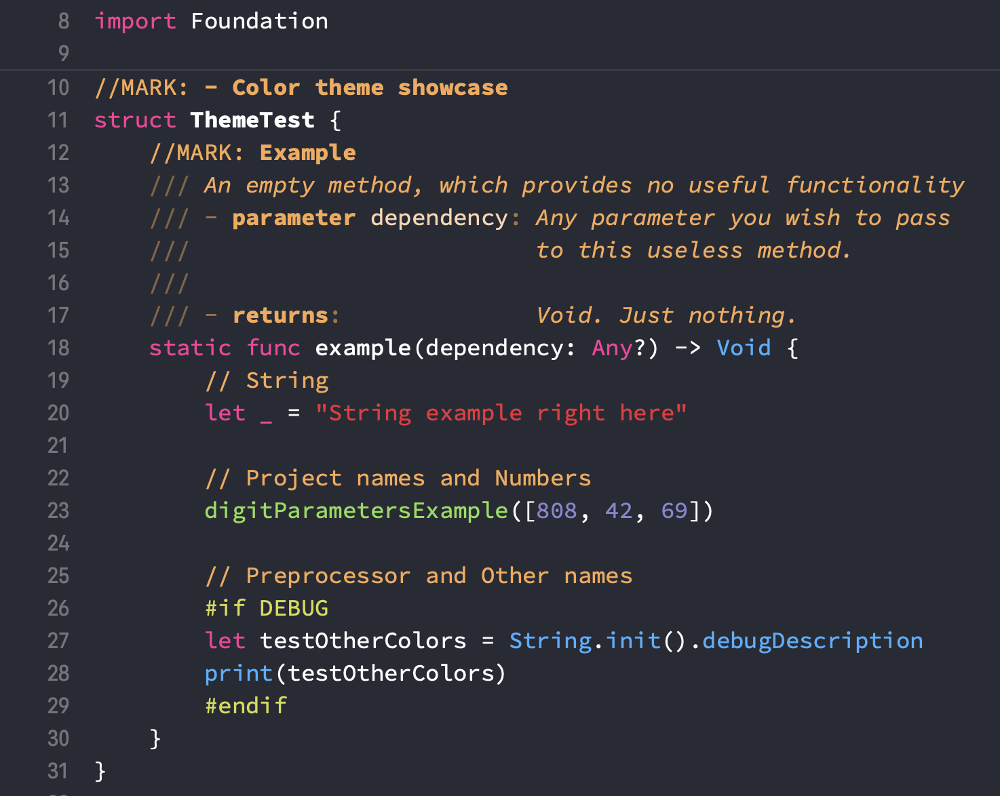

# 🎨 EBODKUM's Xcode Theme

Originally [a project of John Sundell](https://github.com/JohnSundell/XcodeTheme), this repository contains the Xcode theme that I use. Feel free to use it or modify it to your liking 👍



## Installing using Swift Package Manager

The easiest way to install this Xcode theme is to clone this repo and execute `swift run`:

```
$ git clone https://github.com/default/XcodeTheme.git
$ cd XcodeTheme
$ swift run
```

This will install [Adobe's Source Code Pro](https://github.com/adobe-fonts/source-code-pro) font and this Xcode theme for you. Afterward, you can remove the downloaded folder:

```
$ cd ..
$ rm -rf XcodeTheme
```

## Installing manually

You can also choose to do things manually if you want:

1. Clone this repo:
```
$ git clone https://github.com/default/xcodetheme.git
```

2. Create a folder at this path if it doesn't exist already:
```
~/Library/Developer/Xcode/UserData/FontAndColorThemes
```

3. Copy the file `EBDOKUM.xccolortheme` into the above folder.

4. Download the latest release of Source Code Pro from [its repo](https://github.com/adobe-fonts/source-code-pro).

5. Unzip the font archive and move the files in the `TTF` folder to `~/Library/Fonts`.

6. Should've used the install script, right? 😉

## Attributions

This particular color theme is the result of careful tweaking of Xcode's `Dusk` color theme. Colors are made to look distinctly unique to every category for a better and quicker overview. The font used here is the [Adobe's Source Code Pro](https://github.com/adobe-fonts/source-code-pro).
